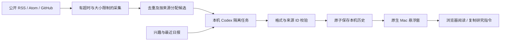

# 架构

## 模块

| 模块 | 职责 |
| --- | --- |
| `BriefCore/Models.swift` | 候选、日报、来源、设置及安全 URL 规则 |
| `BriefCore/FeedService.swift` | 公开采集，RSS/Atom 和 GitHub 解析，部分失败状态 |
| `BriefCore/CodexService.swift` | CLI 探测、摘要规则、输出结构与候选来源校验 |
| `BriefCore/CodexProcess.swift` | 无 shell 拼接的进程调用、输出限制、超时及进程组取消 |
| `BriefCore/Storage.swift` | 原子持久化、历史恢复、进程锁与重试状态 |
| `BriefCore/Schedule.swift` | 显式时区下的每日触发与夏令时处理 |
| `SideBrief/AppModel.swift` | 主线程状态、一次更新事务、网络和唤醒恢复 |
| `SideBrief/AppDelegate.swift` | 浮层、侧边标签、屏幕变化与菜单栏 |
| `SideBrief/BriefViews.swift` | 阅读、首次使用与设置 |

## 更新边界

1. 首次点击生成后启用用户选择的自动更新设置。
2. 获取进程锁，自动任务重新检查磁盘，避免不同进程重复生成。
3. 同时采集最多 4 个来源；每个来源最多 20 秒、3MB。
4. 每源最多 12 条候选，公平轮询后至多 70 条。
5. 在调用 Codex 前持久化尝试次数。重复点击被主线程状态阻止。
6. Codex 返回指定 JSON 格式，仅包含已有候选 ID。来源链接和时间由程序回填。
7. 保存成功历史后更新最新副本；副本损坏可从有效历史恢复。
8. 采集、生成、校验失败都保留上一期；成功但落盘失败时，保留当前内存结果并提示用户检查磁盘。

## 后续扩展

增加 API 接入时，复用候选、日报、校验和持久化模型，新增内容生成实现。密钥应使用 macOS Keychain，用户主动选择服务商；不从 Codex 失败自动转入付费 API。

增加主题预设时，将兴趣与来源作为一组配置；窗口和调度不需要耦合 AI、政治、金融或其他领域。当前仅有一份配置和一条日报历史，不声称已实现多主题订阅。

正式发布还需要跨设备验收、Developer ID 签名、公证及版本更新策略。
